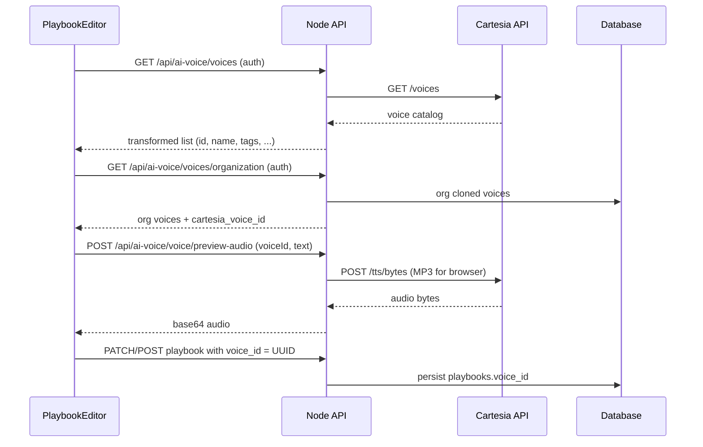

# Cartesia Text-to-Speech — Product Specification

**Last updated:** April 2026  
**Status:** Implemented (Paperboat CRM + AI Voice Service)  
**Primary vendor:** [Cartesia](https://cartesia.ai/)

---

## 1. Purpose

This document describes the **product intent**, **user-facing behavior**, and **implementation boundaries** for Cartesia-powered text-to-speech across Paperboat. It is written for product, design, and engineering stakeholders and complements operational docs (e.g. cost and stack overviews).

**Scope:** TTS only (speech synthesis and voice management). Speech-to-text, LLM, and telephony transport are out of scope except where they define TTS requirements (e.g. audio format for a call leg).

---

## 2. Problem & value

### Problem

Customers expect AI voice experiences to sound **natural**, **on-brand**, and **low-latency**. Generic phone-system TTS or a single default voice does not support demos, personalization, or multilingual positioning.

### Value

- **Voice library:** Access to a large, evolving catalog of voices (languages, accents, styles) sourced from Cartesia’s API.
- **Consistency:** Playbooks and demos use **stable voice UUIDs**, not brittle display names.
- **Quality vs speed:** Different surfaces use different Sonic models and encodings (e.g. fast streaming for live calls, MP3 for browser previews).
- **Customization:** Organizations can **clone** a voice from a short recording and reuse it like any library voice, subject to Cartesia and policy constraints.

---

## 3. Personas & primary use cases

| Persona                    | Use case                                                                                  | Success looks like                                                                                 |
| -------------------------- | ----------------------------------------------------------------------------------------- | -------------------------------------------------------------------------------------------------- |
| **Prospect / visitor**     | Hear a **voice preview** on marketing or demo flows without signing in                    | Instant, clear audio; limited abuse (e.g. length caps on public preview).                          |
| **Authenticated user**     | Browse **full catalog**, pick a voice for AI voice / playbooks, **preview** before saving | Reliable list, search/filter as implemented in UI; preview matches selected voice.                 |
| **Org admin / power user** | **Clone** a brand or speaker voice; manage org-specific voices                            | Clone succeeds with acceptable sample quality; stored voice ID usable everywhere TTS is supported. |
| **Callee (dialer)**        | Hear **voicemail or scripted audio** on a phone call                                      | Audio matches org voice when configured; graceful fallback if TTS fails.                           |

---

## 4. Product capabilities

### 4.1 Voice discovery

- **Source of truth:** Voices are fetched from Cartesia (`GET /voices`), not hardcoded long-term lists.
- **Featured / curated sets:** Marketing or onboarding flows may show a **subset** (e.g. “featured” English voices) for clarity; the full catalog remains available where the product exposes it.
- **Identity:** The system stores and sends **Cartesia voice UUIDs**. Display names are for UI only and may change on Cartesia’s side.

### 4.2 Voice preview (browser)

- **Authenticated:** Full preview for arbitrary sample text (within reasonable limits enforced by API).
- **Public (unauthenticated):** Stricter limits (e.g. max characters) to prevent abuse and cost runaway.
- **Output:** Typically **MP3** at a standard sample rate suitable for web playback—not the same format as real-time phone pipelines.

### 4.3 Live AI voice (real-time pipeline)

- **Goal:** Minimize time from model text to audible audio in a phone conversation.
- **Output format:** Raw **PCM** at **16 kHz**, signed 16-bit little-endian—aligned with downstream real-time audio handling (not browser MP3).
- **Model selection:** Prefers **low-latency** Sonic variants appropriate for streaming; exact model IDs may evolve as Cartesia ships updates.
- **Streaming:** Audio is consumed in chunks as it arrives to reduce perceived latency.

### 4.4 Dialer / telephony (e.g. voicemail playback)

- **Goal:** TTS output must match **Twilio (or similar) expectations** for the media leg (e.g. **μ-law**, **8 kHz** raw) when playing synthesized speech in-call.
- **Fallback:** If Cartesia is unavailable or misconfigured, fall back to **carrier TTS** (e.g. Polly) so the call still completes with a spoken message.

### 4.5 Voice cloning (organization voices)

- **Input:** User provides recorded speech (minimum duration and quality per Cartesia; product enforces “good sample” messaging in UI/help as needed).
- **Options:** Optional **enhancement/denoising** when supported by Cartesia.
- **Persistence:** On success, the Cartesia **voice ID** is stored per organization with metadata (name, description, type = cloned).
- **Deletion:** Removing an org voice triggers **delete on Cartesia** (best effort) and removal from our database so IDs are not reused incorrectly.

### 4.6 Language & pronunciation

- **Language:** TTS requests pass a **language code** compatible with Cartesia (typically short codes such as `en`, not always full BCP-47 locales—implementation normalizes as needed).
- **Custom pronunciations:** Product may support **word → spoken form** mappings for brands and jargon; these are applied as text preprocessing, not as a separate Cartesia feature name in this spec.

### 4.7 Reliability & fallback (AI voice service)

- **Primary:** Cartesia for synthesis.
- **Secondary:** If Cartesia fails repeatedly in a session, the system may switch to **alternate TTS** (e.g. OpenAI) with **voice mapping** so gender/tone stay plausible—not necessarily a perfect acoustic match.
- **User-visible:** Prefer **no hard failure** on a live call when a fallback exists; log errors for operations.

---

## 5. Non-functional requirements

| Area               | Requirement                                                                                                                             |
| ------------------ | --------------------------------------------------------------------------------------------------------------------------------------- |
| **Security**       | `CARTESIA_API_KEY` is **server-side only**; never exposed to browsers or mobile clients.                                                |
| **API versioning** | All Cartesia calls include a fixed **`Cartesia-Version`** header aligned with tested behavior.                                          |
| **Cost control**   | Public endpoints rate-limit or cap input length; authenticated previews remain bounded by product policy.                               |
| **Observability**  | Log Cartesia HTTP failures with status and truncated body; do not log full transcripts in production logs unless compliant with policy. |
| **Accessibility**  | Previews and call audio remain understandable; UI should surface language/accent metadata where the catalog provides it.                |

---

## 6. Explicit non-goals (current)

- **SSML parity** with legacy telephony TTS systems (we use light text preprocessing and Cartesia features, not full SSML suites).
- **Guaranteed** acoustic match between Cartesia and any fallback TTS provider.
- **End-user** voice cloning without org/admin context (product is org-scoped where cloning exists).

---

## 7. Dependencies & assumptions

- Cartesia account, API key, and acceptable use for **voice cloning** and **commercial** usage.
- Voice IDs and model IDs may **change** over time; product code favors **API-driven** lists and **configurable** model IDs per surface.
- Telephony behavior assumes Twilio-compatible audio when using μ-law paths.

---

## 8. Implementation architecture (how the code fits together)

This section is for engineers **porting or mirroring** the integration: it describes how Paperboat wires Cartesia through the stack so another app can implement the same patterns.

### 8.1 Components at a glance

| Layer                         | Responsibility                                                                                                                         | Key files                                                                                                                     |
| ----------------------------- | -------------------------------------------------------------------------------------------------------------------------------------- | ----------------------------------------------------------------------------------------------------------------------------- |
| **Web app**                   | Voice picker, preview playback, clone UI, saving `voice_id` on the playbook                                                            | `src/pages/PlaybookEditor.tsx`, `src/components/home/HowItWorks.tsx` (public demo)                                            |
| **API (Node)**                | Proxy to Cartesia (never expose API key to browser), playbook CRUD with `voice_id`, dialer TwiML paths that need TTS                   | `api/src/routes/aiVoice.ts`, `api/src/routes/playbooks.ts`, `api/src/routes/dialer/callbacks.ts`, mount in `api/src/index.ts` |
| **AI Voice Service (Python)** | Real-time calls: STT/LLM/TTS pipeline; reads **`voice_id` from playbook JSON** and calls Cartesia (streaming) with OpenAI TTS fallback | `ai-voice-service/src/services/pipeline.py`, config in `ai-voice-service/src/config.py`                                       |
| **Database**                  | Persist chosen voice UUID on playbook; store org-cloned voice IDs                                                                      | `playbooks.voice_id`; `organization_voices.cartesia_voice_id` (see migrations below)                                          |

**Environment variable (server-side everywhere Cartesia is called):** `CARTESIA_API_KEY`.

**Cartesia HTTP contract (all direct calls):**

- Header `X-API-Key: <CARTESIA_API_KEY>`
- Header `Cartesia-Version: 2024-06-10` (must stay in sync with tested API behavior)

### 8.2 Data model

1. **`playbooks.voice_id` (TEXT)**
   - Stores a **Cartesia voice UUID** (e.g. default “Blake” UUID used when the client omits a choice).
   - Legacy migrations mapped old string names to UUIDs (`sql/migrations/054_fix_voice_ids_to_uuids.sql`).
   - API validation: `api/src/routes/playbooks.ts` (optional `voice_id` in schema; default UUID on create/update when missing).

2. **`organization_voices`**
   - Rows tie an org to **`cartesia_voice_id`** returned from Cartesia’s clone API, plus display name/metadata.
   - Cloned voices are **first-class IDs**: the UI lists them alongside catalog voices and passes the same UUID into `voice_id` on the playbook.

### 8.3 Flow A — Choose a voice and attach it to a playbook



- **Catalog and preview** never hit the browser with the raw Cartesia key: the **Node** route in `aiVoice.ts` calls Cartesia and returns JSON (e.g. base64 MP3 for previews).
- **Saving** is standard playbook persistence: the same UUID string is what downstream TTS uses.

### 8.4 Flow B — Voice cloning (optional product feature)

1. UI uploads audio + name → `POST /api/ai-voice/voice/clone` (`aiVoice.ts`).
2. Node builds **multipart** `POST https://api.cartesia.ai/voices/clone/clip` (`clip`, `name`, optional `description`, optional `enhance`).
3. Response includes **`id`** (UUID). Node inserts **`organization_voices`** with `cartesia_voice_id = id`.
4. User selects that voice in the editor like any library voice: **`playbooks.voice_id`** = that UUID.
5. Delete path: `DELETE` org voice → Node calls `DELETE https://api.cartesia.ai/voices/{voiceId}` then removes the DB row.

### 8.5 Flow C — Live AI voice (real-time pipeline)

- Outbound/inbound calls are handled by the **AI Voice Service**, not by in-browser Cartesia.
- When a session starts, the service receives **playbook context** (JSON) that includes at least:
  - **`voice_id`** — Cartesia UUID (from `playbooks.voice_id`)
  - **`voice_emotion` / speed / `voice_language`** as your product defines
  - **`custom_pronunciations`** — map of whole-word replacements applied before TTS (`pipeline.py`)
  - **`voice_gender`** — used only for **OpenAI fallback** voice mapping, not for Cartesia

- **`CartesiaTTS`** in `pipeline.py` builds `POST https://api.cartesia.ai/tts/bytes` with:
  - `model_id` (e.g. low-latency Sonic for streaming)
  - `transcript` (after tag/pronunciation preprocessing)
  - `voice`: `{ "mode": "id", "id": "<voice_id>" }` plus optional experimental controls
  - `output_format`: **raw PCM s16le @ 16 kHz** for the telephony/real-time path
  - `language`: short code (e.g. `en`)

- **Streaming:** same URL, HTTP streaming response, chunks fed to the media path.
- **Fallback:** `TTSWithFallback` uses OpenAI TTS if Cartesia errors persist; mapping uses `voice_gender` and known UUID→gender heuristics.

The Node app proxies WebSocket/TwiML to this service (`api/src/index.ts`); exact URL patterns live next to those proxies.

### 8.6 Flow D — Dialer voicemail (Twilio playback)

- **`api/src/routes/dialer/callbacks.ts`** builds TwiML for voicemail drop (or similar).
- If `CARTESIA_API_KEY` and playbook **`voice_id`** are present, Node calls **`POST /tts/bytes`** with an **`output_format` suited to Twilio** (e.g. **μ-law, 8 kHz** raw), base64-encodes, and plays `data:audio/x-mulaw;base64,...`.
- On failure or missing config, **Twilio `<Say>`** (e.g. Polly) speaks the text instead.

This is the same **Cartesia voice UUID** as the playbook; only the **audio encoding** differs from Flow C.

### 8.7 Public vs authenticated Cartesia routes

| Route pattern                                                      | Auth     | Typical use                                                    |
| ------------------------------------------------------------------ | -------- | -------------------------------------------------------------- |
| `GET /api/ai-voice/voices/public`, `POST .../preview-audio/public` | None     | Marketing homepage demo; **stricter limits** on preview length |
| `GET /api/ai-voice/voices`, previews, clone                        | Required | Full catalog, org flows                                        |

Implementations differ slightly in **`model_id`** for previews (`sonic-2` vs `sonic-turbo-*`) — see `aiVoice.ts` for exact bodies.

### 8.8 Per-surface `model_id` and `output_format` (replicate deliberately)

Do **not** assume one global model/format:

| Surface            | Encoding purpose              | Implemented in                |
| ------------------ | ----------------------------- | ----------------------------- |
| Browser preview    | MP3 @ 44.1 kHz                | `aiVoice.ts` (preview routes) |
| Real-time AI voice | PCM s16le @ 16 kHz, streaming | `pipeline.py` (`CartesiaTTS`) |
| Twilio voicemail   | μ-law @ 8 kHz raw             | `dialer/callbacks.ts`         |

### 8.9 File checklist for a full port

- **UI:** voice list + filters + preview + persist `voice_id` → `PlaybookEditor.tsx` pattern.
- **Playbook API:** optional `voice_id`, sensible default UUID → `playbooks.ts`.
- **Cartesia gateway:** voices, preview, clone, delete → `aiVoice.ts`.
- **Migrations:** `voice_id` column; optional `organization_voices` → `010_add_ai_voice_columns.sql`, `026_ai_voice_full_features.sql`, `054_fix_voice_ids_to_uuids.sql`.
- **Live TTS:** playbook-driven `CartesiaTTS` + fallback → `pipeline.py`.
- **Dialer TTS:** Twilio-oriented format → `dialer/callbacks.ts`.
- **App entry:** mount routes and any AI-voice WebSocket/TwiML proxy → `api/src/index.ts`.

---

## 9. Cartesia API reference (from our code)

This is **not** a substitute for Cartesia’s own documentation (pricing, quotas, and request schemas can change). It records **exactly how Paperboat calls** `https://api.cartesia.ai` so another team can match behavior. Official product links: [cartesia.ai](https://cartesia.ai/), voice library UI: [play.cartesia.ai](https://play.cartesia.ai/).

### 9.1 Base URL and authentication

| Item                   | Value                                                             |
| ---------------------- | ----------------------------------------------------------------- |
| **Base**               | `https://api.cartesia.ai`                                         |
| **Secret**             | `CARTESIA_API_KEY` (environment variable; never sent to browsers) |
| **Header**             | `X-API-Key: <CARTESIA_API_KEY>`                                   |
| **API version header** | `Cartesia-Version: 2024-06-10` on **every** request below         |

JSON bodies use `Content-Type: application/json` unless noted.

### 9.2 List voices

|                                   |                                                                                                                                                                                                                                      |
| --------------------------------- | ------------------------------------------------------------------------------------------------------------------------------------------------------------------------------------------------------------------------------------ |
| **Method / path**                 | `GET /voices` → `https://api.cartesia.ai/voices`                                                                                                                                                                                     |
| **Headers**                       | `X-API-Key`, `Cartesia-Version` (no `Content-Type` required)                                                                                                                                                                         |
| **Response handling in our code** | Body may be a **JSON array** of voices, or an object with `.voices` (or `.data`). Each voice includes at least `id` (UUID), `name`, `language`, `gender`, `description`, and flags such as `is_public`. We dedupe by `id` in places. |
| **Implementation**                | `api/src/routes/aiVoice.ts` (`GET /voices`, `GET /voices/public`)                                                                                                                                                                    |

### 9.3 Text-to-speech — `POST /tts/bytes`

Full URL: `https://api.cartesia.ai/tts/bytes`.

**Common JSON fields:**

| Field           | Purpose                                                                     |
| --------------- | --------------------------------------------------------------------------- |
| `model_id`      | Sonic model name (varies by surface; see 9.4)                               |
| `transcript`    | Text to speak                                                               |
| `voice`         | Object with `mode: "id"` and `id: "<cartesia voice uuid>"`                  |
| `output_format` | `container`, `encoding`, `sample_rate`                                      |
| `language`      | **Only in AI voice pipeline:** short code string (e.g. `en`), from playbook |

**Optional `voice` fields (AI voice service only):**

```json
"__experimental_controls": {
  "speed": "normal"
}
```

Our `CartesiaTTS` class sets this on the voice object for real-time calls (`ai-voice-service/src/services/pipeline.py`).

**Streaming:** The Python service uses the **same** `POST /tts/bytes` URL with an HTTP client in **streaming** mode (`httpx` `stream("POST", ...)`) and reads the response body in chunks (~3.2 KB chunks); retries on 5xx up to 3 attempts.

### 9.4 `model_id` and `output_format` by surface (as implemented)

These differ **on purpose**; copy the pair that matches your surface.

#### A. Public homepage preview (Node)

- **File:** `api/src/routes/aiVoice.ts` — `POST /voice/preview-audio/public`
- **`model_id`:** `sonic-2`
- **`transcript`:** user text truncated to **200 characters**
- **`output_format`:** MP3 @ 44.1 kHz

```json
{
	"model_id": "sonic-2",
	"transcript": "<preview text, max 200 chars>",
	"voice": { "mode": "id", "id": "<voiceId>" },
	"output_format": {
		"container": "mp3",
		"encoding": "mp3",
		"sample_rate": 44100
	}
}
```

#### B. Authenticated voice preview (Node)

- **File:** `api/src/routes/aiVoice.ts` — `POST /voice/preview-audio`
- **`model_id`:** `sonic-turbo-2025-03-07`
- **`output_format`:** same MP3 structure as (A), full `transcript` from request body

#### C. Real-time AI voice pipeline (Python)

- **File:** `ai-voice-service/src/services/pipeline.py` — class `CartesiaTTS`
- **Default `model_id`:** `sonic-turbo` (constructor default)
- **`output_format`:** raw PCM signed 16-bit little-endian @ **16 kHz**
- **`language`:** included (e.g. `en`)

```json
{
	"model_id": "sonic-turbo",
	"transcript": "<processed text>",
	"voice": {
		"mode": "id",
		"id": "<playbook voice_id uuid>",
		"__experimental_controls": { "speed": "normal" }
	},
	"output_format": {
		"container": "raw",
		"encoding": "pcm_s16le",
		"sample_rate": 16000
	},
	"language": "en"
}
```

#### D. Dialer voicemail / Twilio playback (Node)

- **File:** `api/src/routes/dialer/callbacks.ts`
- **`model_id`:** `sonic-english`
- **`output_format`:** raw μ-law @ **8 kHz** (Twilio-friendly)

```json
{
	"model_id": "sonic-english",
	"transcript": "<message>",
	"voice": { "mode": "id", "id": "<voiceId from playbook>" },
	"output_format": {
		"container": "raw",
		"encoding": "pcm_mulaw",
		"sample_rate": 8000
	}
}
```

We base64 the bytes and pass them as `data:audio/x-mulaw;base64,...` to Twilio’s play URL.

### 9.5 Clone voice — `POST /voices/clone/clip`

|                      |                                                                                                                                                                     |
| -------------------- | ------------------------------------------------------------------------------------------------------------------------------------------------------------------- |
| **URL**              | `https://api.cartesia.ai/voices/clone/clip`                                                                                                                         |
| **Content-Type**     | `multipart/form-data` (do **not** set `Content-Type: application/json`; let the client set boundary)                                                                |
| **Headers**          | `X-API-Key`, `Cartesia-Version`                                                                                                                                     |
| **Parts (our app)**  | `clip` — file field, filename `audio.wav`; `name` — string (required); `description` — optional string; `enhance` — optional, literal `"true"` string for denoising |
| **Success response** | JSON with at least `id` (new voice UUID). We persist `clonedVoice.id` as `cartesia_voice_id`.                                                                       |
| **Implementation**   | `api/src/routes/aiVoice.ts` — `POST /voice/clone`                                                                                                                   |

### 9.6 Delete voice — `DELETE /voices/{voiceId}`

|                    |                                                                                       |
| ------------------ | ------------------------------------------------------------------------------------- |
| **URL**            | `https://api.cartesia.ai/voices/<voiceId>`                                            |
| **Headers**        | `X-API-Key`, `Cartesia-Version`                                                       |
| **Body**           | None                                                                                  |
| **Implementation** | `api/src/routes/aiVoice.ts` — delete org cloned voice (after verifying org ownership) |

### 9.7 Text preprocessing before TTS (AI voice service only)

Before calling Cartesia, `pipeline.py` may alter `transcript`:

- Replace bracket tags like `[pause]` with punctuation (see `NATURAL_SOUNDS` in `CartesiaTTS`).
- Apply **`custom_pronunciations`** from the playbook: whole-word regex replacements for brand names, etc.

Cartesia does not receive raw SSML from us for those; it receives the **processed** string in `transcript`.

---

## 10. Open questions (for roadmap)

- Unified **model ID policy** across previews vs live pipeline vs dialer (today intentionally optimized per surface).
- **Analytics:** aggregate preview usage, clone success rate, and TTS error rate by surface.
- **Compliance:** retention and deletion guarantees for cloned voice audio on Cartesia vs our DB.
